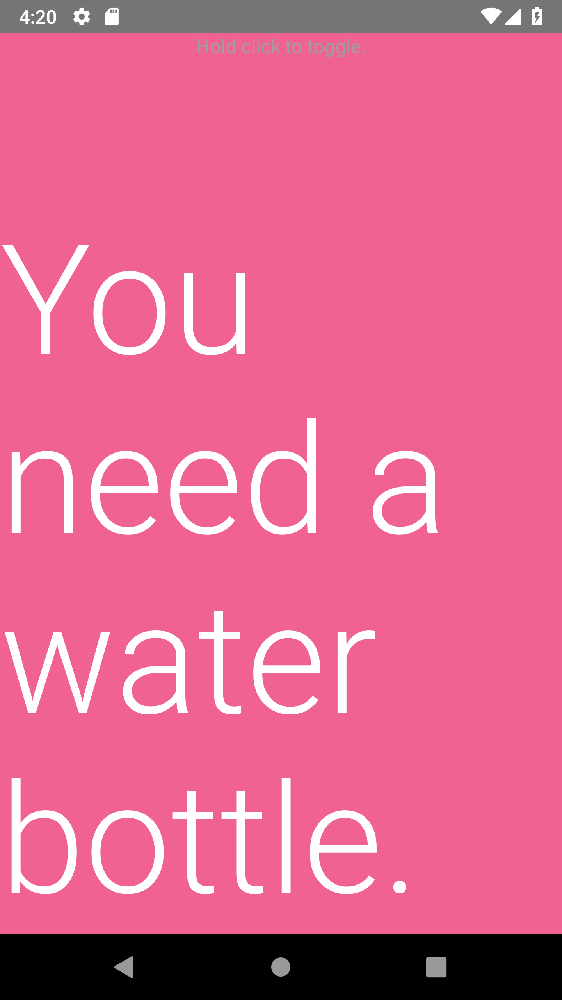

# Water Bottle Status

My solution to forgetting about water bottles which I did not finish. This tracks in a very obvious way if there is an open water bottle or not, so I don't end up with multiple water bottles which are half full.

### When you have a water bottle:

### No water bottle:

